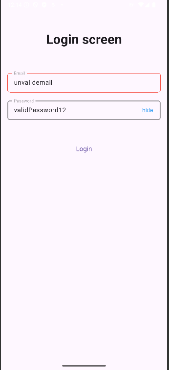

# r_r_t_app

Red Rocket test app

### Code gen

To execute code generation use:
```
flutter pub run build_runner build --delete-conflicting-outputs
```

### To build app for stores
### iOS ( this version was created on windows os, so iOS build was not implemented)
```
flutter build ipa --flavor test_app --release
```

### Android ( app was tested with android emulator API 35, and Pixel 8 )
```
flutter build appbundle --flavor test_app --release
```

### Images 




